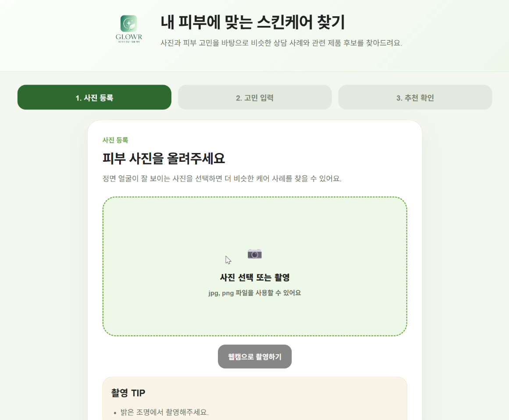
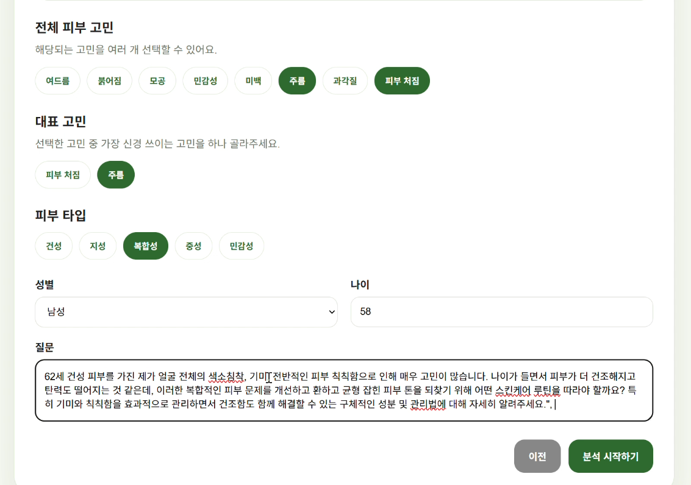
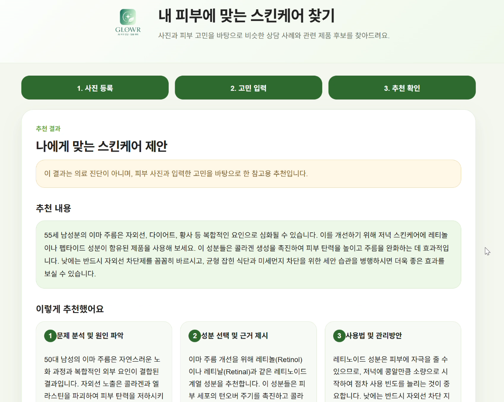

# GLOWR - 개인 맞춤형 스킨케어 추천 Web

> 얼굴 이미지에서 피부 컨디션을 추정하고, 사용자의 피부 고민과 유사한 상담 사례를 검색하여 스킨케어 관리 방법과 관련 제품 후보를 제공하는 AI 기반 Web 서비스입니다.

사용자는 얼굴 사진과 피부 고민을 입력합니다.  
시스템은 이미지 모델을 통해 피부 상태 코드를 추정하고, 기존 상담 데이터에서 사용자 조건과 질문이 유사한 사례를 검색합니다.

이후 선택된 상담 사례의 추천 답변에서 성분명을 추출하고, 화장품 DB의 전성분 정보와 비교하여 관련 제품 후보를 제공합니다.

> 본 서비스의 피부 분석 결과와 제품 후보는 의료 진단이나 치료 목적이 아닌 참고용 정보입니다.

---

## 1. Project Overview

스킨케어 제품이나 관리 방법을 선택할 때는 같은 피부 고민을 가지고 있더라도 피부 타입, 연령, 피부 상태 등에 따라 적합한 관리 방향이 달라질 수 있습니다.

본 프로젝트에서는 단순히 사용자의 질문과 비슷한 문장을 찾는 데 그치지 않고,

- 얼굴 이미지에서 추정한 피부 상태
- 사용자가 입력한 피부 고민
- 피부 타입
- 성별
- 연령대
- 질문의 의미 유사도

를 함께 활용하여 기존 상담 데이터에서 유사 사례를 검색하도록 구성했습니다.

### 전체 서비스 흐름

```text
얼굴 사진 업로드 / 웹캠 촬영
            ↓
EfficientNet-B0
            ↓
8개 피부 상태 항목 예측
            ↓
피부 상태 코드 생성
            ↓
사용자 입력
(성별 / 나이 / 피부 타입 / 피부 고민 / 질문)
            ↓
대표 고민 기반 상담 후보 선별
            ↓
Sentence-BERT 질문 의미 유사도
        +
구조화 조건 유사도
            ↓
가장 유사한 상담 사례 선택
            ↓
추천 답변 + 추천 근거
            ↓
답변에서 성분명 추출
            ↓
MySQL 제품 전성분과 매칭
            ↓
관련 제품 후보 제공
```

---

## 2. My Contribution

3인 팀 프로젝트로 진행했으며, 제가 담당한 주요 영역은 다음과 같습니다.

- EfficientNet-B0 기반 피부 이미지 다중 분류 모델 구현
- 이미지 모델 추론 결과를 피부 상태 코드로 변환
- Sentence-BERT 기반 상담 질문 의미 유사도 검색
- 피부 고민·피부 상태·피부 타입·연령대·성별을 활용한 Hybrid 추천 점수 설계
- 추천 답변에서 성분명을 추출하는 제품 연결 로직 구현
- MySQL 제품 DB 전성분 기반 관련 제품 후보 조회
- Flask API를 통한 이미지 모델·NLP 추천·제품 추천 통합
- React 기반 사용자 입력 및 결과 화면 구현
- 이미지 업로드 및 웹캠 촬영 기능 구현

---

## 3. Skin Image Analysis

사용자가 업로드하거나 웹캠으로 촬영한 얼굴 이미지는 EfficientNet-B0 기반 Multi-output 모델에 입력됩니다.

하나의 이미지 특징을 공유하면서 각 피부 항목별 분류 Head에서 개별 결과를 예측하도록 구성했습니다.

```text
Face Image
    ↓
Resize / Normalize
    ↓
EfficientNet-B0 Backbone
    ↓
Shared Image Feature
    ↓
Multiple Classification Heads
    ↓
피부 상태별 예측 코드
```

각 Head의 예측 결과를 하나의 문자열로 결합하여 상담 사례 검색에 사용할 피부 상태 코드로 구성합니다.

예:

```text
NS/P1/W2/NA/VP/SA/ND/R
```

각 결과에는 해당 예측 클래스에 대한 confidence가 함께 계산됩니다.

> confidence는 해당 피부 상태가 실제로 그 비율만큼 존재한다는 의미가 아니라, 모델이 선택한 클래스에 대한 예측 확률입니다.

---

## 4. Similar Case Recommendation

스킨케어 추천은 새로운 답변을 생성하는 방식이 아니라, 기존 상담 데이터에서 현재 사용자와 가장 유사한 사례를 검색하는 방식으로 구성했습니다.

### Step 1. 대표 고민 기반 후보 선별

사용자가 선택한 대표 피부 고민과 같은 상담 사례를 우선 후보로 사용합니다.

정확히 일치하는 사례가 없는 경우 대표 고민 문자열이 포함된 사례까지 후보 범위를 확장합니다.

### Step 2. 질문 의미 유사도

사용자의 질문을 다국어 Sentence-BERT 모델로 Embedding합니다.

```text
사용자 질문
      ↓
Sentence-BERT
      ↓
Question Embedding
      ↕ Cosine Similarity
기존 상담 질문 Embeddings
```

사용 모델:

```text
sentence-transformers/paraphrase-multilingual-MiniLM-L12-v2
```

기존 상담 질문의 Embedding은 미리 계산하여 저장하고, 서비스 실행 시 사용자 질문만 새로 Embedding하도록 구성했습니다.

### Step 3. 사용자 조건 비교

질문 내용뿐 아니라 다음 조건을 함께 비교합니다.

| 조건 | 비교 방식 |
|---|---|
| 전체 피부 고민 | Jaccard Similarity |
| 이미지 기반 피부 상태 코드 | 항목별 코드 일치 비율 |
| 피부 타입 | Exact Match |
| 연령대 | Age Group Match |
| 성별 | Exact Match |

5개의 점수를 평균하여 `structured_score`를 계산합니다.

```text
Structured Score
=
(피부 고민
 + 피부 상태
 + 피부 타입
 + 연령대
 + 성별) / 5
```

### Step 4. Hybrid Score

최종적으로 질문 의미 유사도와 사용자 조건 유사도를 동일 비중으로 결합합니다.

```text
Final Score
=
(Question Similarity + Structured Similarity) / 2
```

Final Score가 가장 높은 상담 사례의 답변과 추천 근거를 사용자에게 제공합니다.

---

## 5. Ingredient-based Product Matching

제품 DB에는

```text
"이 제품은 주름 피부에 적합"
"이 제품은 민감성 피부용"
```

과 같은 피부 고민별 정답 라벨이 존재하지 않습니다.

따라서 피부 고민과 제품을 직접 연결하지 않고, **상담 추천 답변에서 언급된 성분과 제품 DB의 실제 전성분을 연결하는 방식**으로 제품 후보를 조회했습니다.

### 제품 후보 조회 흐름

```text
추천 답변 + 추천 근거
        ↓
DB에 실제 존재하는 성분명 탐색
        ↓
공백 / 특수문자 정규화
        ↓
성분명 부분 포함 Matching
        ↓
각 제품의 ingredients 컬럼과 비교
        ↓
일치 성분 수 계산
        ↓
평점 + 리뷰 수 보조 반영
        ↓
관련 제품 후보 최대 3개 출력
```

### Ingredient Normalization

성분 표기 방식의 차이를 줄이기 위해 공백과 일부 특수문자를 제거한 후 비교합니다.

예:

```text
쑥잎 추출물
쑥잎추출물
```

→ 정규화 후 연결 가능

또한 일부 부분 포함 관계도 확인합니다.

```text
세라마이드
    ↕
세라마이드엔피
```

다만 의미가 비슷한 단어나 한글·영문 성분명을 의미적으로 변환하는 방식은 아닙니다.

```text
진정 ↔ 판테놀       X
알로에신 ↔ ALOESIN  X
```

따라서 최종 결과는 피부 고민에 대한 의학적 제품 처방이 아니라, **추천 답변의 성분과 연결되는 참고 제품 후보**입니다.

### Product Ranking

제품 정렬에는 다음 정보를 사용합니다.

```text
Product Score
=
일치 성분 수 × 10
+ 평점
+ log(1 + 리뷰 수) × 0.5
```

일치 성분이 없는 제품을 억지로 채우지 않기 때문에 조건에 따라 3개보다 적은 제품이 표시될 수 있습니다.

---

## 6. Web Service

AI 모델과 추천 로직을 실제로 사용할 수 있도록 React + Flask + MySQL 기반의 Web 서비스를 구현했습니다.

### Frontend

React에서 다음 기능을 제공합니다.

- 얼굴 이미지 업로드
- PC 웹캠 촬영
- 전체 피부 고민 다중 선택
- 대표 고민 선택
- 피부 타입 입력
- 성별 및 나이 입력
- 자유 질문 입력
- 분석 진행 화면
- 추천 답변 및 추천 근거 확인
- 피부 이미지 분석 결과 확인
- 관련 제품 후보 확인

### Backend

Flask API에서는 다음 순서로 요청을 처리합니다.

```text
React
  ↓ multipart/form-data
Flask API
  ↓
SkinImagePredictor
  ↓
SkincareRecommender
  ↓
ProductRecommender
  ↓
JSON Response
  ↓
React Result Page
```

---

## 7. Service Screens

### 사진 등록



사용자는 기존 이미지 파일을 업로드하거나 웹캠을 이용해 직접 사진을 촬영할 수 있습니다.

### 피부 고민 입력



전체 피부 고민, 대표 고민, 피부 타입, 성별, 나이 및 자유 질문을 입력합니다.

### 추천 결과



유사 상담 사례를 기반으로 한 추천 내용과 추천 근거를 확인할 수 있으며, 추천 답변에서 언급된 성분과 전성분이 연결되는 제품 후보를 함께 제공합니다.

---

## 8. Tech Stack

### AI / Data

`Python` · `PyTorch` · `torchvision` · `EfficientNet-B0` · `Sentence-BERT` · `scikit-learn` · `Pandas` · `NumPy`

### Backend / Database

`Flask` · `Flask-CORS` · `PyMySQL` · `MySQL`

### Frontend

`React` · `JavaScript` · `HTML` · `CSS`

---

## 9. Repository Structure

```text
skincare-recommendation-web/
├─ README.md
├─ .gitignore
│
├─ backend/
│  ├─ app.py
│  ├─ image_model.py
│  ├─ recommender.py
│  ├─ product_recommender.py
│  ├─ requirements.txt
│  │
│  └─ artifacts/
│     ├─ best_skin_efficientnet_b0_multioutput_final.pth
│     ├─ label_encoders.pkl
│     ├─ model_info.pkl
│     ├─ train_json_df.pkl
│     └─ train_question_embeddings.npy
│
├─ frontend/
│  ├─ package.json
│  ├─ yarn.lock
│  ├─ public/
│  └─ src/
│
├─ database/
│  └─ cosmetic.sql
│
└─ docs/
   └─ screenshots/
      ├─ 01_upload.png
      ├─ 02_input.png
      └─ 03_result.png
```

---

## 10. Installation

### 1. Repository Clone

```bash
git clone https://github.com/josw777/skincare-recommendation-web.git
cd skincare-recommendation-web
```

### 2. Backend

Python 가상환경을 생성합니다.

```bash
python -m venv .venv
```

Windows에서 가상환경을 활성화합니다.

```bash
.venv\Scripts\activate
```

필요한 라이브러리를 설치합니다.

```bash
pip install -r backend/requirements.txt
```

### 3. MySQL Database

`database/cosmetic.sql`을 MySQL에 Import하여 제품 DB를 생성합니다.

기본 설정:

```text
Database : cosmetic
Table    : cosmetic_products
Host     : localhost
Port     : 3306
```

`backend/app.py`의 MySQL 접속 정보를 자신의 환경에 맞게 설정해야 합니다.

### 4. Flask Server

```bash
cd backend
python app.py
```

기본 주소:

```text
http://localhost:5000
```

### 5. React

새 Terminal에서 실행합니다.

```bash
cd frontend
yarn install
yarn start
```

기본 주소:

```text
http://localhost:3000
```

`package.json`의 proxy 설정을 통해 React 요청이 Flask의 `localhost:5000`으로 전달됩니다.

---

## 11. Runtime Notes

- NVIDIA GPU는 필수가 아닙니다.
- CUDA를 사용할 수 있는 환경에서는 PyTorch가 GPU를 사용합니다.
- CUDA를 사용할 수 없는 경우 CPU로 추론합니다.
- Sentence-BERT 모델은 최초 실행 시 다운로드가 필요할 수 있으므로 인터넷 연결이 필요합니다.
- MySQL 서버가 실행되어 있어야 제품 후보 조회 기능을 사용할 수 있습니다.

---

## 12. Limitations

현재 프로젝트에는 다음과 같은 한계가 있습니다.

- 얼굴 이미지 분석 결과는 의료적 피부 진단이 아님
- 이미지 품질, 조명, 촬영 환경에 따라 피부 상태 예측 결과가 달라질 수 있음
- 추천 답변은 생성형 AI가 새롭게 작성하는 것이 아니라 기존 상담 사례 검색 결과를 사용함
- 제품 DB에는 피부 고민별 제품 적합성 라벨이 없음
- 제품 추천은 추천 답변에서 언급된 성분과 제품 전성분의 문자열 기반 연결을 사용함
- 한글·영문 성분명 변환 및 의미적 성분 유사도까지 처리하지 않음
- 추천 답변에서 DB와 연결되는 성분이 없는 경우 제품 후보가 표시되지 않을 수 있음

---

## 13. Future Work

- 성분명 한글·영문 표준화
- 화장품 성분 사전 또는 성분 Ontology 연계
- 성분의 기능 및 피부 고민과의 관계를 반영한 제품 추천 고도화
- 이미지 모델의 실제 환경 데이터 검증
- 상담 사례 Retrieval 방식 개선
- 사용자 피드백을 활용한 추천 품질 평가
- 서비스 배포 환경 구성

---

## Notes

이 프로젝트는 이미지 분류 모델의 예측 결과만 보여주는 데 그치지 않고,

**이미지 분석 → 사용자 조건 기반 상담 검색 → NLP 질문 유사도 → 추천 답변 → 제품 DB 성분 매칭 → Web 서비스**

까지 하나의 파이프라인으로 연결하는 것을 목표로 구현했습니다.